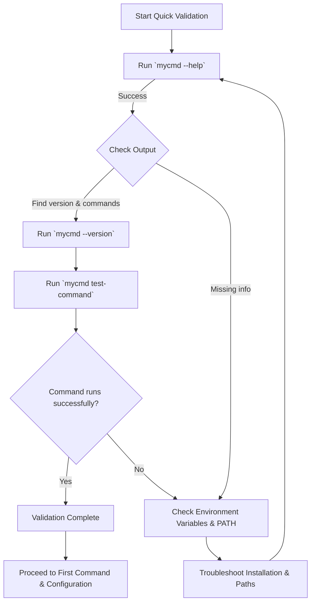

# Quick Validation Checks

This guide helps you swiftly verify that your MyCmd installation is functioning as expected immediately after setup. You will learn practical commands to:

- Display help messages and version info
- List available commands and command groups
- Run a simple built-in command to confirm basic execution

You will also learn to identify visual indicators of success and troubleshoot common first-run issues.

---

## 1. Verify `mycmd` Help Output

The primary contact point for MyCmd is the `mycmd` command itself. To confirm your installation is recognized and the CLI is operational, run:

```bash
mycmd --help
```

or equivalently:

```bash
mycmd -h
```

**Expected results:**

- The output should start with the MyCmd version number, e.g., `mycmd version 0.1-...`
- A usage summary describing the CLI syntax.
- A list of environment variables that can influence MyCmd's behavior.
- Lists of top-level command groups and commands available.


> <Check>
> If you see an error like 'command not found', ensure your PATH is correctly set to include MyCmd's installation.
> </Check>

---

## 2. Check MyCmd Version

Confirm the installed MyCmd version directly:

```bash
mycmd --version
```

This should output something like:

```
mycmd version 0.1-GITHASH
```

indicating the version and build information.

---

## 3. List Available Command Groups and Commands

You can explore the scope of commands and groups by running:

```bash
mycmd --help
```

Alternatively, to see specific groups or commands, you can append them like:

```bash
mycmd <command_group> --help
```

For example, inspecting the `project` command group:

```bash
mycmd project --help
```

This command will list subcommands and options available within `project`.


> <Tip>
> Use `mycmd <command_group> <command> --help` to get help for subcommands.
> </Tip>

---

## 4. Run a Basic Built-in Test Command

A practical way to test command execution is to run the included test command:

```bash
mycmd test-command
```

**What this does:**

- Runs a simple MyCmd-internal test command.
- Produces a few output lines confirming it ran.

**Expected output:**

```
Running test-command.
Finished starting of test-command.
Finished execution of test-command.
```

This verifies that MyCmd can locate, load, and execute commands successfully.

---

## 5. Confirm Visual Cues and Logging

MyCmd commands provide immediate visual feedback—both standard output and error output include timestamps for traceability if environment variables are set (e.g., `MYCMD_TRACE`).

During these checks:

- Look for the presence of descriptive output lines.
- Check for absence of error messages.

If `MYCMD_DEBUG` or `MYCMD_TRACE` are enabled, expect detailed internal logs that help diagnose issues.

---

## 6. Troubleshooting Common Issues in Quick Validation

<AccordionGroup title="Common Issues and Solutions">
<Accordion title="Command Not Found">
- Verify your PATH includes the directory where `mycmd` is installed.
- Run `echo $PATH` and confirm inclusion.
- Follow [Setting Up Your Environment](../setup-prerequisites-installation/path-setup-post-install) to fix environment variables.
</Accordion>
<Accordion title="Help or Version Displays Incorrect or Missing">
- Confirm environment variables `MYCMD_SYSTEM_BASE_DIR`, `MYCMD_USER_BASE_DIR`, and `MYCMD_VENDOR_DIR` are set and point to existing directories.
- Inspect environment setup following [Environment Validation](mycmd-environment-lib.md).
</Accordion>
<Accordion title="Test-Command Fails to Run">
- Check that the `test-command` script is installed under the correct user base directory.
- Confirm no permissions issues prevent execution.
- Review debug logs if `MYCMD_DEBUG=1` is set.
</Accordion>
</AccordionGroup>

---

## 7. Next Steps After Validation

Once you see all expected output and commands execute correctly:

- Proceed to [Running Your First Command](../first-run-and-validation/first-command) to try more commands interactively.
- Explore [Installing MyCmd](../setup-prerequisites-installation/installing-mycmd) for details on extending your installation.
- Read [Configuring MyCmd for Your Workflow](../configuration-troubleshooting/configuring-mycmd) to customize.
- Consult [Troubleshooting Installation and First Run](../configuration-troubleshooting/troubleshooting-setup) for detailed assistance.


<Note>
By performing these Quick Validation Checks, you ensure that your MyCmd installation is reliable and ready to power your Bash command workflow.
</Note>

---

## 8. Example Quick Validation Session

```bash
$ mycmd --help
mycmd version 0.1-GITHASH

MyCmd: The Bash Command Framework

Usage:
mycmd [-h | --help] [-v | --version]
mycmd <command_group>... [-h | --help] [-v | --version] [arguments]
mycmd <command_group>... <command> [-h | --help] [-v | --version] [arguments]

Environment variables recognized:
... (list shown)

Command Groups:
create
logging
project
shell
test-command-group

Commands:
test-command

$ mycmd test-command
Running test-command.
Finished starting of test-command.
Finished execution of test-command.

$ mycmd --version
mycmd version 0.1-GITHASH
```

---

## 9. Summary Diagram: Quick Validation Workflow



This flowchart shows the quick steps to validate your MyCmd installation.

---

## 10. Helpful Tips

- Always run commands in a terminal shell that has sourced your environment setup.
- Use `MYCMD_DEBUG=1` to get additional logging if commands fail silently.
- Make sure directories referenced by environment variables exist and are accessible.

---

For more detailed onboarding and next steps, consult the [Running Your First Command](../first-run-and-validation/first-command) guide.
