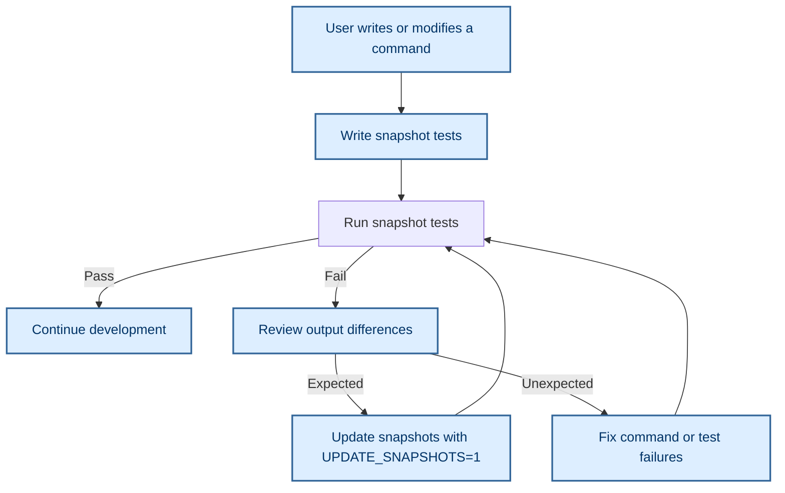

# Snapshot Testing for Command Consistency


## Introduction

Snapshot testing within MyCmd provides a powerful mechanism to ensure your commands produce consistent and expected outputs over time. By capturing "snapshots" of command output and comparing them automatically during test runs, you guard against regressions, unexpected changes, and environment-dependent variations.

This guide introduces you to using snapshot testing in MyCmd, illustrating the typical user flow, practical examples, and integration tips for making your script validation robust and maintainable.

---

## Why Snapshot Testing?

Imagine you’ve created a command that outputs intricate details about your system or project state. Manually verifying that output remains unchanged after edits or updates is error-prone and tedious.

Snapshot testing automatically captures the "golden" snapshot (expected output) and compares future test executions against it. When differences arise, you’re alerted to verify if code changes are intentional or unexpected.

This is particularly useful in scenarios where output contains variable elements such as timestamps and file paths, as snapshot testing workflows incorporate filtering to normalize such data.

---

## Prerequisites

- You already have MyCmd installed and configured properly. 
- Basic understanding of running Bash commands and using the MyCmd CLI.
- Access to the MyCmd test suite and testing directories.
- Familiarity with shell scripting and `shunit2` test framework is helpful but not mandatory.

---

## Expected Outcome

By following this guide, you will:

- Understand how to write snapshot tests for MyCmd commands.
- Execute snapshot tests to verify command output consistency.
- Update snapshots safely as your commands evolve.
- Leverage filtering to handle varying test output.

---

## Time Estimate

Allow approximately 30-45 minutes to complete initial learning and first test creation.

---

## Snapshot Testing Workflow in MyCmd

### 1. Writing a Snapshot Test

Your snapshot tests live in scripts named with the suffix `-snapshot-test`. Each test script defines three key functions per test case:

- `test_<testName>()` — runs assertions comparing output against snapshots.
- `snapshot_<testName>()` — executes the command or series of commands whose output will be captured.
- `filter_<testName>()` — transforms dynamic output (e.g., timestamps, paths) into normalized forms for reliable comparisons.

This triad ensures comprehensive testing and manages variability in test environments.

### 2. Running The Snapshot Test

Tests use the `shunit2` testing framework internally, but you interact with them via MyCmd task registrations like `execute-snapshot-tests` or running individual test files directly.

Running the tests will:

- Execute the `snapshot_` function to capture fresh output.
- Apply the `filter_` function to normalize output.
- Compare results against stored snapshots located in `testing/snapshots`.
- Show successes or highlight mismatches.

### 3. Updating Snapshots

When intentional changes occur in command output, you can update snapshots automatically by setting the environment variable `UPDATE_SNAPSHOTS=1`. This triggers the test runner to overwrite the stored "golden" snapshots with current test output after filtering.


## Step-by-Step Instructions

<Steps>
<Step title="Create a New Snapshot Test File">
Create a new test file inside the `testing/tests` directory ending with `-snapshot-test`.

Use the provided `snapshot-test-template-file` as a starting point:

```bash
cp support/templates/snapshot-test-template-file testing/tests/my-new-snapshot-test
```

This template includes the structure for defining snapshot functions and filter functions.
</Step>

<Step title="Implement Snapshot and Filter Functions">
Edit your new test file:

- Define `snapshot_<testName>()` to run the commands whose output you want to test.
- Define `filter_<testName>()` to normalize output, such as replacing absolute paths or dynamic values with placeholders.
- Write `test_<testName>()` to run the snapshot and assert correctness using built-in helpers.

```bash
function snapshot_example_command() {
    mycmd example-command --list
}

function filter_example_command() {
    sed -E -e 's/\/[a-zA-Z0-9_\/]+/\/path\/to\/project/g' -e 's/[0-9]{4}-[0-9]{2}-[0-9]{2}/DATE/'
}

function test_example_command() {
    execute_and_assert_exit_code_and_snapshot 0
}
```
</Step>

<Step title="Run Snapshot Tests">
Execute the snapshot tests using MyCmd:

```bash
mycmd execute-snapshot-tests
```

This will run all snapshot tests, comparing outputs.

To run a specific snapshot test file, use:

```bash
mycmd execute-single-file-tests testing/tests/my-new-snapshot-test
```
</Step>

<Step title="Update Snapshots When Output Changes">
When expected output changes, update snapshots by setting:

```bash
UPDATE_SNAPSHOTS=1 mycmd execute-single-file-tests testing/tests/my-new-snapshot-test
```

This updates the stored "golden" snapshot files for future comparisons.

Be cautious to review changes before updating snapshots to avoid masking unintended regressions.
</Step>

<Step title="View Snapshot Files and Logs">
Snapshots are saved under `testing/snapshots` with filenames matching the test and test case names.

Test execution logs and outputs are stored in temporary test output directories under the `tmp` folder.

You can browse the last test log or coverage reports:

```bash
mycmd page-last-test-log
mycmd page-last-test-coverage-reports
```
</Step>
</Steps>

---

## Practical Example

Here is a simplified example extracted from the snapshot test suite:

```bash
function snapshot_mycmd_launcher_help() {
    _mycmd --help
}

function filter_mycmd_launcher_help() {
    sed -E \
        -e "s/mycmd version 0.1-.*/mycmd version 0.1-GITHASH/" \
        -e "s%${HOME}%HOME%"
}

function test_mycmd_launcher_help() {
    execute_and_assert_exit_code_and_snapshot 0
}
```

This snapshot test runs `mycmd --help`, filters variable data such as version hash and user home directory paths, and asserts the output against the saved snapshot.

---

## Tips and Best Practices

- **Always write a filter function** when snapshot output contains variable data: timestamps, file paths, commit hashes, etc.
- **Regularly run tests during development** to catch regressions early.
- **Use the `UPDATE_SNAPSHOTS` variable intentionally** only to update snapshots after confirming expected changes.
- **Keep snapshots under version control** to review changes collaboratively.
- **Structure test names logically** reflecting command features or options for easier maintenance.
- **Leverage existing snapshot tests** to learn patterns and avoid reinventing filtering logic.

---

## Common Issues and Troubleshooting

<AccordionGroup title="Common Snapshot Testing Issues">
<Accordion title="Tests Fail Due to Path or Timestamp Differences">
If your snapshots fail because of files paths or timestamps in output, confirm you have a filter function that normalizes these values.

Example Filters:

```bash
sed -E -e "s/\/home\/user/HOME/" -e "s/[0-9]{4}-[0-9]{2}-[0-9]{2}/DATE/"
```
</Accordion>
<Accordion title="Snapshot Files Not Updating When Expected">
Ensure you set the environment variable `UPDATE_SNAPSHOTS=1` in the same shell session before running tests.

Example:

```bash
UPDATE_SNAPSHOTS=1 mycmd execute-single-file-tests testing/tests/mycmd-bin-snapshot-test
```

If snapshots still do not update, verify file write permissions and that your test naming conventions are followed correctly.
</Accordion>
<Accordion title="Test Execution Errors Related to Missing Dependencies">
Make sure that:

- `shunit2` is correctly installed or vendored.
- Your testing environment paths include MyCmd binaries.
- Environment variables like `TEST_OUTPUT_DIR` are set when running tests manually.

Refer to the troubleshooting setup guide if needed.
</Accordion>
</AccordionGroup>

---

## How Snapshot Testing Fits in Your Workflow

Snapshot testing complements other layers of testing and validation:



This sequence ensures that your commands remain reliable, and changes are intentional and verified.

---

## Next Steps and Related Documentation

- Review the [Writing Custom Commands](../command-authoring-and-best-practices/writing-custom-commands) guide to learn how to extend MyCmd commands effectively.
- Explore the [Debugging and Logging in Your Commands](../command-authoring-and-best-practices/debugging-commands) guide to enhance your test diagnostics.
- Familiarize yourself with [Automating Project Workflows with MyCmd](../advanced-workflows-and-integration/automating-project-workflows) to integrate snapshot testing into CI pipelines.
- Refer to the [Core Concepts & Terminology](../../overview/architecture-core-concepts/core-concepts-terminology) to strengthen your understanding of MyCmd’s architecture.

---

## References

- Snapshot files location: `testing/snapshots`
- Snapshot test files location: `testing/tests` with `-snapshot-test` suffix
- Relevant template files: `support/templates/snapshot-test-template-file`
- Testing framework: `shunit2`

---

By integrating snapshot testing into your MyCmd development, you establish a robust safety net that catches regressions early and eases ongoing maintenance of your automation scripts.

Start capturing your command output now to enforce consistency and trust in your CLI workflows.
