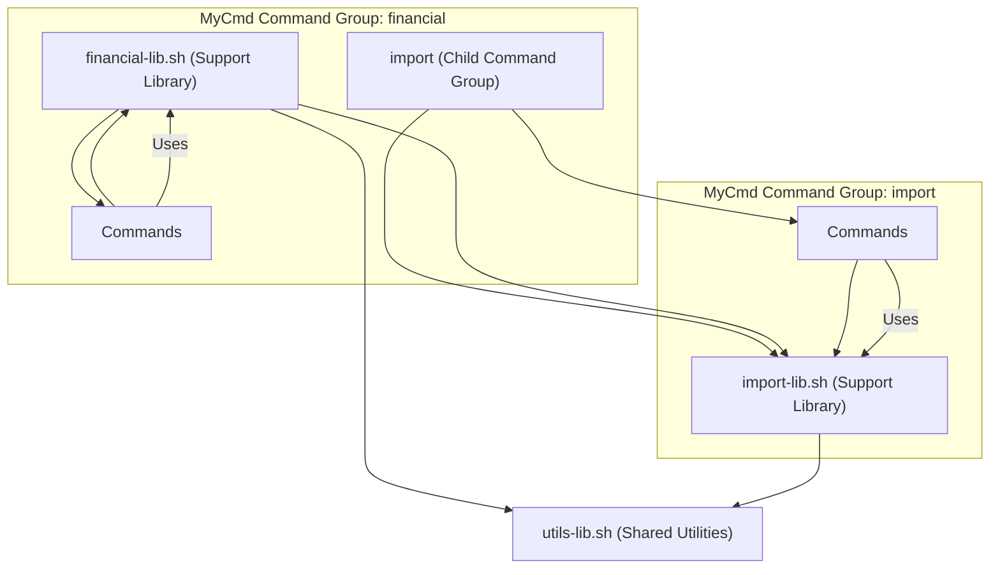

# Common Patterns for Reuse and Collaboration

Discover effective approaches to maximize code reuse, seamlessly share logic across commands, and foster collaboration within your MyCmd projects. This guide focuses on practical directory structures, code organization, and strategies to reduce duplication and improve maintainability.

---

## 1. Why Reuse and Collaboration Matter in MyCmd

In a growing automation project, productivity hinges on reusing code efficiently and maintaining consistent patterns across multiple commands and teams. MyCmd's hierarchical command groups and shell library conventions are designed to encourage clean separation, ease sharing of common functionality, and simplify collaboration.

By following these common patterns, you minimize duplicated effort, reduce errors, and build scalable automation frameworks.

---

## 2. Core Concepts

Before diving into patterns, recall key MyCmd concepts:

- **Command Group:** A directory representing a group of commands that share common code and context.
- **Command:** An individual executable script invoked via the MyCmd launcher.
- **Shell Library:** A support shell script (usually suffixed with `-lib`) paired with a command group that provides reusable functions.
- **Registry:** The global metadata store that tracks command groups and commands discovered by MyCmd.

These concepts serve as the building blocks for reuse and collaboration.

---

## 3. Structuring Command Groups and Libraries for Reuse

### 3.1 Organize Code by Responsibility

- **Command Group Directory:** Contains commands and a single `command-group-lib.sh` shell library.
- **Shell Library:** Encapsulates shared functions utilized by all commands in that group.

#### Example Directory Layout:

```plaintext
mycmd/financial/                     # Command Group directory
├── import/                          # Child command group
│   ├── import-lib.sh                # Support library for import group
│   ├── chase-visa                  # A command script
│   └── amex-importer               # Another command script
├── financial-lib.sh                # Support library for financial group
├── report-annual                   # Command script in financial group
└── reconciliation                  # Command script in financial group
```

### 3.2 Share Code via Support Libraries

1. Write reusable helper functions in the command group library (`import-lib.sh`, `financial-lib.sh`).
2. Commands source the library automatically when loaded by MyCmd.
3. Libraries can source parent group libraries for hierarchical code reuse.

---

## 4. Code Sharing Patterns Across Commands

### 4.1 Intra-Group Code Sharing

Share logic close to the commands that use it:

- Put common shell functions in the command group's `-lib` file.
- Access shared configuration and constants centralized here.

### 4.2 Inter-Group Reuse

When several groups share functionality:

- Create a **shared support library** in a higher-level group or a dedicated utility group.
- Have child command groups source the shared libraries in their own `-lib` files.

Example:

- `mycmd/utils/util-lib.sh` for generic utility functions
- Sourced in `mycmd/financial/financial-lib.sh` and other libraries

### 4.3 Reuse with the Registry

Functions using the global MyCmd Registry can reference metadata:

- Access command or group attributes dynamically (name, version, description).
- Use provided prefix function conventions like `mycmd:command_group.register_short_description` for metadata registration.

This approach reduces duplication of help and version strings.

---

## 5. Collaboration Strategies

### 5.1 Naming Conventions

Follow strict naming to avoid collisions and ease discovery:

- Prefix top-level functions and variables with `mycmd`.
- Use colons to specify object types, e.g., `mycmd:command_group:load`.
- Use periods before function names within modules.
- Internal-only functions start with an underscore, e.g., `_mycmd:command_group:init`.

Adopting these helps other developers quickly identify the scope and usage.

### 5.2 Document Metadata and Help Text Consistently

Encourage command authors to provide:

- `short_description` for brief summaries
- `help_text` for detailed usage
- `version` information

Register these consistently to populate the registry and improve auto-help features.

### 5.3 Shared Testing and Validation

- Maintain shared libraries of shell functions for common test assertions (e.g., output capture, error code checks).
- Use snapshot tests (see [Snapshot Testing for Command Consistency](/guides/advanced-workflows-and-integration/snapshot-testing)) to catch regressions.

### 5.4 Branch Collaboration Model

- Use Git branches or forks for feature isolation.
- Integrate coding standards and linters (in planning, see MyCmd Planning) to ensure consistency.

---

## 6. Practical Example: Creating a Reusable Logging Function

### 6.1 Define the Logging Library

Inside `mycmd/logging/logging-lib.sh`:

```bash
function logging.log_info() {
    mycmd.output_with_timestamp "[INFO] $*"
}

function logging.log_error() {
    mycmd.error_output "[ERROR] $*"
}
```

### 6.2 Use in Commands

In any command script under the logging group:

```bash
#!/usr/bin/env bash

function mycmd.main() {
    logging.log_info "Starting operation"
    # do work
    if error_occurred; then
        logging.log_error "An error happened"
        return 1
    fi
    logging.log_info "Operation completed successfully"
}
```

This pattern centralizes logging capabilities and provides consistent output formatting.

---

## 7. Best Practices

- **Centralize common code:** Keep all common helpers in command group libraries.
- **Use supported conventions:** Follow naming rules to keep functions discoverable.
- **Avoid duplication:** Check existing libraries before writing new code.
- **Document thoroughly:** Register metadata for all commands and groups.
- **Keep command scripts lightweight:** Delegate logic to libraries.
- **Version control and branch management:** Coordinate team collaboration.

---

## 8. Common Pitfalls and Troubleshooting

<AccordionGroup title="Common Issues When Reusing Code">
<Accordion title="Function Naming Collisions">
Conflicting function names can cause unexpected behavior.

**Solution:** Always use the `mycmd:` prefix and specify object type, e.g., `mycmd:logging.log_info`.
</Accordion>
<Accordion title="Library Load Order Problems">
If a support library isn’t loaded before commands use its functions, errors will occur.

**Solution:** Confirm your command group libraries source their dependencies properly, and ensure the `mycmd` registry is loaded.
</Accordion>
<Accordion title="Metadata Not Registering">
Commands missing descriptions or help text can reduce usability.

**Solution:** Use the registry helper functions to register metadata during command initialization.
</Accordion>
</AccordionGroup>

---

## 9. Next Steps & Further Learning

- Explore [Writing Custom Commands and Command Groups](/guides/command-authoring-and-best-practices/writing-custom-commands) to build on reuse strategies.
- Learn about [Debugging and Logging](/guides/command-authoring-and-best-practices/debugging-commands) for efficient collaboration.
- Dive into the [MyCmd Concepts And Conventions](/mycmd-concepts-and-conventions) document for detailed naming and code organization rules.
- Review [Snapshot Testing for Command Consistency](/guides/advanced-workflows-and-integration/snapshot-testing) to implement robust testing.

---

## 10. Visualizing MyCmd Command Group and Library Relationships



This diagram shows hierarchical sourcing and code reuse within command groups.

---

<Tip>
Using shared support libraries not only saves time but also enforces consistency across your commands, making your scripts easier to maintain and extend.
</Tip>

<Check>
Adopt naming conventions strictly and register all metadata for clarity and discoverability.
</Check>

<Note>
Start small with clear reuse boundaries and gradually refactor to share code as your project grows.
</Note>
