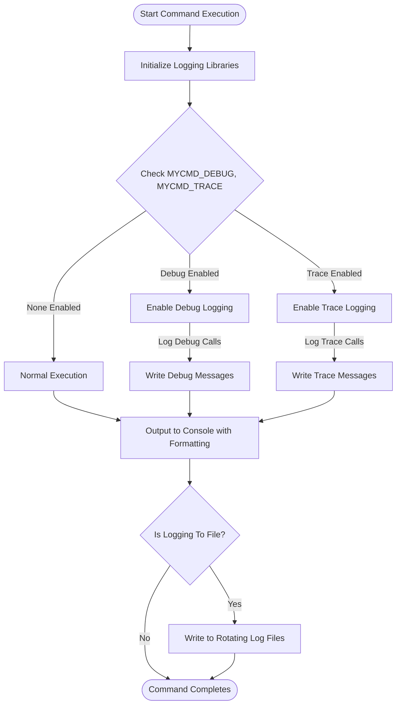

# Debugging and Logging in Your Commands

## Overview

This guide teaches you how to effectively troubleshoot and diagnose issues when developing commands in the MyCmd framework by using the built-in logging libraries, formatted output utilities, and established diagnostic conventions. You will learn how to enable detailed logging, use timestamped and colored outputs, and interpret logs to gain clarity on what your commands are doing during execution.

---

## 1. Understanding the MyCmd Logging and Output Support Libraries

MyCmd provides foundational libraries designed to simplify command output and logging:

- **mycmd-output-lib**: Handles basic output and error logging with timestamp support.
- **mycmd-formatted-output-lib**: Wraps a vendored ANSI library for colored and formatted terminal output.
- **mycmd-logging-lib**: Offers advanced log file capture, rotation, and safe terminal output preserving colors.

Together, these allow you to produce clear, timestamped, and colorized logs that aid troubleshooting.

### Key Features

- Logging messages to stdout, stderr, or log files.
- Automatic timestamp prefixes in logs for tracing events.
- Conditional debug and trace logs controlled by environment variables (`MYCMD_DEBUG`, `MYCMD_TRACE`).
- Rotating log files with compression to manage disk use.
- Use of ANSI color codes to distinguish log levels and messages visually.

---

## 2. Setting Up Logging in Your Command

Before diving into debugging your command, ensure you properly integrate MyCmd logging facilities:

### Step 1: Source the Output and Logging Libraries

Inside your command script or library, confirm you source and have access to these libraries:

```bash
source "${MYCMD_SYSTEM_BASE_DIR}/mycmd/mycmd-output-lib"  # Basic output
source "${MYCMD_SYSTEM_BASE_DIR}/mycmd/mycmd-formatted-output-lib"  # Colored/formatted output wrapping ansi
source "${MYCMD_SYSTEM_BASE_DIR}/mycmd/logging/logging-lib"  # Capture, rotate, and display logs
```

### Step 2: Use Provided Logging Functions

Replace all direct `echo` or `printf` calls for user-visible output with:

- `mycmd.output "Your message"`: outputs to stdout
- `mycmd.output_with_timestamp "Message"`: outputs with timestamp
- `mycmd.error_output "Error message"`: outputs error messages with timestamp to stderr
- `mycmd.log "Log message"`: logs message to stderr or configured log file with timestamp

### Step 3: Enable Debug and Trace Logging

Use these conditionally with environment variables:

- **Debug Logging:**

  ```bash
  mycmd.debug "Detailed debug message describing internal state or variables"
  ```

- **Trace Logging:**

  ```bash
  mycmd.trace "Step execution trace for fine-grained diagnostics"
  ```

> **Tip:** Enable `MYCMD_DEBUG=1` and/or `MYCMD_TRACE=1` in your environment to see these outputs during execution.

---

## 3. Using Formatted Output for Clear Diagnostics

Leverage color and text attributes to make your logs more readable and distinct.

### Examples: Colored Debug and Trace Output

```bash
mycmd.debug "$(mycmd.ansi red)Error encountered in function xyz$(mycmd.ansi resetForeground)"
mycmd.trace "$(mycmd.ansi yellow)Entered loop iteration $i$(mycmd.ansi resetForeground)"
```

### Practical Pattern

```bash
if [[ -n "${MYCMD_DEBUG-}" ]]; then
    mycmd.log "[$(mycmd.ansi red)DEBUG$(mycmd.ansi resetForeground)] Variable x = ${x}"  
fi
```

The `mycmd-formatted-output-lib` automatically aliases `mycmd.debug` and `mycmd.trace` to colored outputs.

---

## 4. Capturing Logs with Rotation and Color Preservation

For long running commands or commands generating large logs, use the logging utilities to capture and rotate logs safely while preserving colors.

### Capture and Display a Command's Output with Rotating Logs

```bash
logging.rotate_then_capture_and_display \
    "/var/log/mycmd/mycmd-command.log" 10 3 \
    mycmd output_command --option
```

This example:
- rotates up to 10 previous log files
- keeps 3 of these uncompressed
- preserves ANSI color escape codes
- streams the command output live to console and logs

### Basic Log Capturing Usage

```bash
logging.capture_and_display "/path/to/logfile.log" my_command_to_run arg1 arg2
```

### Best Practices

- Define a consistent location for your log files.
- Use rotation to prevent unbounded disk usage.
- Use timestamps and colored logs to speed diagnosis.

---

## 5. Troubleshooting Common Issues

### Problem: No Logs or Messages Appear

- Confirm environment variables `MYCMD_DEBUG` or `MYCMD_TRACE` are set to enable debug/trace output.
- Check your command properly calls the `mycmd.output`, `mycmd.error_output`, `mycmd.debug`, or `mycmd.trace` functions.
- Verify that logging files and directories exist and are writable.

### Problem: Logs Are Without Color or Formatting

- Ensure you are using the `mycmd.ansi` wrapper for colors, not raw escape sequences.
- Some terminals do not support ANSI; validate with `ansi --color-table`.
- Avoid redirecting logs to files without preserving color support unless desired.

### Problem: Log Files Keep Growing or Cause Disk Space Issues

- Use the `logging.rotate_log_files_if_needed` utility to automate rotation.
- Configure sensible limits for `files_to_keep` and `files_to_keep_uncompressed`.

<Tip>
Always use the built-in logging functions instead of bare shell outputs to ensure consistent, timestamped, and optionally colorized outputs that are easier to debug.
</Tip>

---

## 6. Example: Adding Debug Logging to a Custom Command

```bash
#!/usr/bin/env bash

source "${MYCMD_SYSTEM_BASE_DIR}/mycmd/mycmd-output-lib"
source "${MYCMD_SYSTEM_BASE_DIR}/mycmd/mycmd-formatted-output-lib"
source "${MYCMD_SYSTEM_BASE_DIR}/mycmd/logging/logging-lib"

function mycmd.command_group.my_command() {
    mycmd.debug "Starting my_command execution"
    mycmd.output "Performing operation..."

    if ! result=$(some_failing_operation); then
        mycmd.error_output "Operation failed with message: ${result}"
        return 1
    fi

    mycmd.debug "Operation succeeded with result: ${result}"
    mycmd.output_with_timestamp "Operation completed at $(date)"
}
```

Run the command with debug enabled:

```bash
MYCMD_DEBUG=1 mycmd command-group my_command
```

Expected behavior:
- Debug lines appear in red with timestamps.
- Output and errors properly routed.

---

## 7. Advanced Diagnostic Techniques

### Enabling Shell Trace and Verbose Modes

Activate full Bash execution tracing and verbosity with environment variables:

```bash
export MYCMD_SHELL_TRACE=1  # Enables 'set -x' debugging
export MYCMD_SHELL_VERBOSE=1  # Enables 'set -v' verbose output
```

These cause your command to print detailed shell execution steps, invaluable for root cause analysis.

### Recording Terminal Sessions with vhs

Use the `record-demo` task if you want to record terminal sessions for later review:

```bash
mycmd record-demo <demo-source> <output-file>
```

Requires the external `vhs` tool.

### Analyzing Trace Logs

Use MyCmd's built-in support to convert and visualize shell trace logs into flamegraphs and call hierarchies to identify bottlenecks or unexpected calls:

```bash
mycmd create-flamegraph-from-shell-trace <trace-log-file> <output-svg-file>
mycmd query-call-hierarchy <trace-log-file> <function-name>
```

---

## 8. Summary and Next Steps

By utilizing MyCmd's built-in output, formatted output, and logging libraries, you can significantly accelerate debugging and development efficiency. These tools provide structured, colorful, and timestamped diagnostic information that makes tracking down problems straightforward.

### Next recommended reads:

- [Writing Custom Commands and Command Groups](../command-authoring-and-best-practices/writing-custom-commands)
- [Common Patterns for Reuse and Collaboration](../command-authoring-and-best-practices/common-patterns)
- [MyCmd Workflow Explained](../getting-started-with-mycmd/mycmd-workflow-tour)
- [Troubleshooting Installation and Setup](../configuration-troubleshooting/troubleshooting-setup)


---

## Appendix: Quick Reference of Key Logging Functions

| Function                          | Purpose                                                    |
|---------------------------------|-------------------------------------------------------------|
| `mycmd.output <msg>`             | Standard output to user (stdout)                            |
| `mycmd.output_with_timestamp <msg>` | Outputs message with timestamp                           |
| `mycmd.error_output <msg>`       | Outputs error with timestamp (stderr)                      |
| `mycmd.log <msg>`                | Writes log entry with timestamp to stderr or log file     |
| `mycmd.debug <msg>`              | Conditional debug logging if `MYCMD_DEBUG` is set          |
| `mycmd.trace <msg>`              | Conditional trace logging if `MYCMD_TRACE` is set          |
| `mycmd.ansi <color|attr>`       | Outputs colored or formatted text for terminal             |
| `logging.capture_and_display <logfile> <command...>` | Captures command output with live display and logs |
| `logging.rotate_then_capture_and_display <logfile> <keep-count> <keep-uncompressed> <command...>` | Rotates logs and captures command output |

---

## Diagram: MyCmd Logging Flow


---

This visualizes the core logging flow illustrating environment-based conditional logging and output paths.

---

# End of Guide
