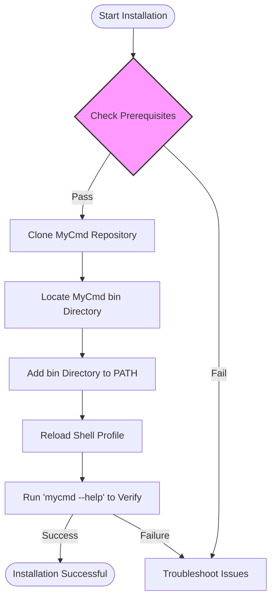

# Installing MyCmd

## Overview
This guide provides clear, step-by-step instructions for installing the MyCmd Bash command framework. From setting up prerequisites to configuring your shell environment, you will learn exactly how to prepare your system to use MyCmd reliably and seamlessly.

---

## 1. Prerequisites
Before installing MyCmd, ensure your system meets the following requirements:

- **Supported Operating System**: Linux or macOS
- **Bash Version**: A modern Bash shell (4.x or higher recommended)
- **GNU Core Utilities**: Essential tools like `sed`, `awk`, `grep`, `realpath`, etc.
- **Git**: Required to clone the MyCmd repository

> Tips:
> - On macOS, install missing GNU tools via Homebrew (`brew install gnu-sed gawk coreutils ...`).
> - Validate your environment variables and PATH settings to avoid conflicts.


## 2. Clone the MyCmd Repository
Start by cloning the official MyCmd GitHub repository to your preferred directory.

```bash
# Clone into your home directory or any desired location
git clone https://github.com/travisbhartwell/mycmd.git ~/mycmd
```


## 3. Locate the MyCmd Binary Directory
Navigate to the `bin` subdirectory which contains the main launcher script.

```bash
cd ~/mycmd/bin
```

Your `mycmd` binary launcher script is located here.


## 4. Set Up Your PATH Environment Variable
To use `mycmd` easily from any shell session, add the `bin` directory to your PATH.

### 4.1. Identify Your Shell Profile File
- **Bash**: Usually `~/.bashrc` or `~/.bash_profile`
- **Zsh**: Usually `~/.zshrc`


### 4.2. Add PATH Export Command
Append the following line at the end of your shell profile file:

```bash
# MyCmd binary path
export PATH="$HOME/mycmd/bin:$PATH"
```

> **Replace `$HOME/mycmd/bin` with the actual path if different.**


### 4.3. Apply Your Changes
Load the updated profile immediately:

```bash
source ~/.bashrc  # or ~/.bash_profile or ~/.zshrc depending on your shell
```


## 5. Verify the Installation
Check if `mycmd` is accessible and running:

```bash
mycmd --help
```

You should see the MyCmd CLI help output.

Try the version command:

```bash
mycmd --version
```


## 6. Common Setup Issues and Troubleshooting

### 6.1. `mycmd: command not found`
- Confirm your PATH export is correct and sourced.
- Verify the absolute path to `mycmd` binary directory is accurate.

### 6.2. Permissions Issues
- Make sure the `mycmd` binary script has execute permissions:

```bash
chmod +x ~/mycmd/bin/mycmd
```

### 6.3. Missing Dependencies or GNU Utilities
- On macOS, ensure GNU utilities are installed via Homebrew, and your PATH uses the GNU versions first.

### 6.4. Conflicts with Older Bash Versions
- Confirm Bash version with:

```bash
bash --version
```

- Upgrade if older than 4.0.


## 7. Next Steps

Once installation and PATH configuration are complete, proceed with:

- [Running Your First Command](/getting-started/first-run-and-validation/first-command)
- [Configuring MyCmd for Your Workflow](/getting-started/configuration-troubleshooting/configuring-mycmd)
- Reviewing System Requirements if you encounter errors


---

## Appendix: Example Shell Profile Addition

Below is a snippet you can add to your shell profile for a typical MyCmd installation in your home folder:

```bash
# >>> MyCmd configuration >>>
export PATH="$HOME/mycmd/bin:$PATH"
# <<< MyCmd configuration <<<
```


## Visual Workflow of Installation and Verification




---

## Additional Resources
- [System Requirements](/getting-started/setup-prerequisites-installation/system-requirements) for detailed OS and dependencies info
- [Setting Up Your Environment](/getting-started/setup-prerequisites-installation/path-setup-post-install) for advanced PATH configuration
- [Troubleshooting Installation and First Run](/getting-started/configuration-troubleshooting/troubleshooting-setup) to resolve common issues
- MyCmd's [Feature Overview](/overview/product-introduction-value/feature-overview) for learning product capabilities


<Check>
Ensure all environment variables and directories referenced in the PATH exist and are accessible.
</Check>

<Note>
This guide assumes familiarity with basic shell commands and permissions.
For new users, consider supplementary tutorials on shell environment customization.
</Note>
