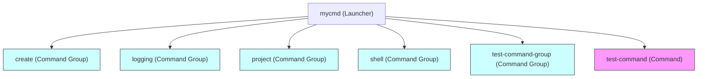

# Command and Command Group Hierarchy

## Understanding the MyCmd Hierarchical Model

At the core of MyCmd lies a well-designed hierarchical structure that organizes your bash automation scripts into **command groups** and **commands**. This page explains how MyCmd maps your command groups to directories and individual commands to script files, enabling modular organization and reusable code that scales seamlessly as your automation grows.

Think of MyCmd as a powerful conductor, orchestrating the execution of your scripts through a clearly defined hierarchy:

- **MyCmd launcher** acts as the top-level entry point.
- **Command Groups** act as folders that organize related commands and other groups.
- **Commands** are the actual executable scripts.

This structure provides clarity, cohesion, and context while making it easy to maintain and extend your automation.

---

## Command Groups: Organizing for Reuse and Modularity

### What Is a Command Group?

A **command group** is a directory representing a logical grouping of related commands and possibly other nested command groups. It encapsulates shared code and metadata, making it easy to reuse functionality across its children.

- Each command group corresponds to a directory named after it.
- A special support library file within that directory, named `<command-group-name>-lib`, contains shared code for that group.
- They are hierarchical, so a command group can have parent and child groups, forming a tree that mirrors your directory structure.

### Why Use Command Groups?

1. **Modular Organization:** Just as folders help organize files, command groups keep your commands logically organized.
2. **Code Reuse:** Shared functionality or helper functions can be placed in the group's support library, automatically available to all child commands and groups.
3. **Scalability:** Nested command groups allow you to build complex structures without creating confusion.

<Tip>
Command groups act both as namespaces and shared code containers. Use them liberally to segment your automation into meaningful areas.
</Tip>

### Real-world Scenario

Imagine you have scripts related to managing your cloud infrastructure. You might create a command group named `cloud` containing subgroups like `aws` and `gcp`. Each subgroup contains commands for specific actions. The `cloud` group library can hold common utility functions like authentication, while `aws-lib` and `gcp-lib` handle provider-specific code.

---

## Commands: Your Executable Scripts

### What Defines a Command?

A **command** is an individual executable script file found within a command group's directory. It represents one actionable operation that you run through MyCmd.

Key attributes of a command

- **Name:** The command's filename.
- **Fully qualified name:** The combined path expressing the hierarchy, e.g., `mycmd/cloud/aws/deploy`.
- **Location:** Resides in the directory of its parent command group.
- **Executable File:** Must be executable and generally a bash script.

### Execution Flow Overview

1. The user invokes `mycmd` followed by a sequence of command groups and a command name, e.g., `mycmd cloud aws deploy`.
2. MyCmd traverses the hierarchy using the search path and directory structure to locate the exact command script.
3. The command script executes with its defined behavior.

<Tip>
Naming your commands clearly and descriptively ensures intuitive navigation through your command hierarchy.
</Tip>

### Example

If you have a command group `project` and inside it a command `list-tasks`, the command fully qualifies as `mycmd/project/list-tasks`. Running `mycmd project list-tasks` invokes the corresponding executable script.

---

## MyCmd: The Implicit Top-Level Launcher

### The Role of the MyCmd Launcher

At the root of the hierarchy exists the **MyCmd launcher** — the single executable binary named `mycmd`.

- It acts as the entry point for all commands.
- It interprets user input, mapping command group names and commands from the CLI into the hierarchical structure.
- Handles initializing context, environment setup, and dispatching control to the right command script.

### User Interaction Flow

1. User types `mycmd` followed by command group(s) and command.
2. `mycmd` launcher scans configured search paths for matching command groups/directories.
3. It loads any necessary support libraries.
4. Passes control internally down to the resolved command.
5. The command script runs with all context and environment set up.

### Search Path and Discovery

MyCmd discovers command groups and commands by looking through directories in the **search path** defined by environment variables such as `MYCMD_SYSTEM_BASE_DIR`, `MYCMD_USER_BASE_DIR`, and optionally `MYCMD_SEARCH_PATH`.

- The launcher ensures system directories are scanned first, then user directories last for overrides.
- Searches are recursive but structured by directory hierarchy.

<Note>
The `mycmd` executable itself is not a command group but the orchestrator that makes the entire hierarchy accessible and coherent.
</Note>

---

## How the Hierarchy Maps to Filesystem

Your folder structure directly corresponds to the command and command group hierarchy.

- **Command groups:** represented as directories containing that group’s code library.
- **Commands:** executable scripts inside those directories.

For instance:

```
$HOME/mycmd/project/project-lib           # Command group "project" support library
$HOME/mycmd/project/list-tasks             # Command script named "list-tasks" in the "project" group
$HOME/mycmd/shell/shell-lib                 # Another command group "shell" with its library
$HOME/mycmd/shell/run                       # Command "run" under the "shell" group
```

Your namespace mirrors this structure:

- `project` is a command group.
- `list-tasks` is a command within `project`.
- Commands under nested groups would be referenced with their full path, e.g., `project list-tasks`.

---

## Practical Tips and Best Practices

- **Keep Command Group Libraries Focused:** Encapsulate only related functions and share only what commands in that group need.
- **Name With Hierarchy In Mind:** Choose descriptive, concise names to make navigating the hierarchy intuitive.
- **Leverage Nested Command Groups:** For larger automations, nested groups help avoid clutter and support logical segregation.
- **Use the Search Path for Extensibility:** Customize your environment variables to add or override command groups.
- **Ensure Commands Are Executable:** Verify script permissions to avoid execution errors.

---

## Troubleshooting Common Pitfalls

<AccordionGroup title="Common Hierarchical Issues and Fixes">
<Accordion title="Command Not Found">
If a command fails to run with a "command not found" error:
- Verify the command exists as an executable file within the appropriate command group directory.
- Check your `MYCMD_SEARCH_PATH` includes the base directory containing your command groups.
- Confirm your invocation matches the command's hierarchy and naming exactly.
</Accordion>
<Accordion title="Command Group Library Not Loaded">
If shared functions are missing or commands fail to find library code:
- Ensure the command group directory contains the `<command-group-name>-lib` file.
- This library must be in the command group directory and sourceable.
- Use `mycmd` debug or trace flags to verify loading.
</Accordion>
<Accordion title="Namespace Conflicts">
When two command groups or commands have the same names in different search path directories:
- MyCmd loads earlier directories in the search path first.
- Check the order of `MYCMD_SEARCH_PATH` and adjust if you want user overrides to take precedence.
</Accordion>
</AccordionGroup>

---

## Visualizing the Command and Command Group Hierarchy



This diagram illustrates that the `mycmd` launcher sits at the top, with command groups such as `create`, `logging`, `project`, `shell`, and `test-command-group` as its children. Individual commands like `test-command` can also be direct children.

---

## Summary

MyCmd's power emerges from its clear and robust hierarchy:

- **MyCmd launcher** is your unified entry point.
- **Command groups** organize your scripts logically, provide reusable libraries, and form the folder-based namespaces.
- **Commands** are executable scripts mapped to files.

This model encourages maintainable, reusable Bash automation with a straightforward user experience.

Always structure your automation projects with scalable hierarchies and leverage command groups for shared logic to maximize your workflow efficiency.

---

## Next Steps

- Explore [Writing Custom Commands and Command Groups](../../guides/command-authoring-and-best-practices/writing-custom-commands) to start creating your own commands.
- Understand how MyCmd locates commands by learning about the [MyCmd Search Path](../core-architecture/mycmd-search-path).
- See how commands execute in detail in the [Launcher and Execution Flow](../core-architecture/command-launcher-execution).
- Familiarize yourself with [Core Concepts and Terminology](../../overview/architecture-core-concepts/core-concepts-terminology) for foundational knowledge.

---

## External Links

- [MyCmd GitHub Repository](https://github.com/travisbhartwell/mycmd)
- [MyCmd Development Blog](https://iam.travishartwell.net/mycmd/)

---

This guide has provided you with a confident understanding of how MyCmd organizes and executes your commands through the command and command group hierarchy. Embrace this structure as the backbone of your automated workflows.