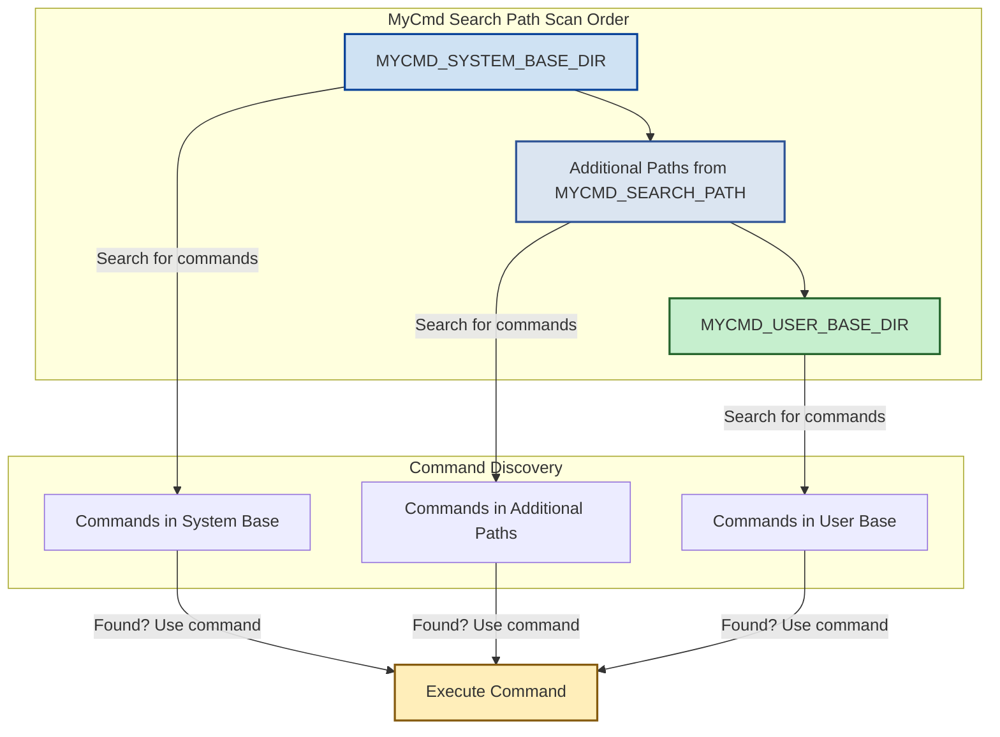

# MyCmd Search Path

The **MyCmd Search Path** is a fundamental concept that determines where MyCmd discovers, loads, and executes your commands and command groups. Understanding the search path empowers you to organize your scripts efficiently, extend MyCmd with additional command directories, and control how command conflicts are resolved.

---

## What is the MyCmd Search Path?

At its core, the MyCmd Search Path is an ordered list of directories that MyCmd scans for commands and command groups. These directories represent the *root locations* from which MyCmd starts searching through the hierarchy of commands.

When you run a command, MyCmd traverses these directories in sequence to locate the matching command or group. The order of entries in this path directly affects which commands are found and executed, enabling you to override or extend existing capabilities by adjusting search path priorities.

---

## Key Components of the Search Path

- **MYCMD_SYSTEM_BASE_DIR**: This is the base directory of the core MyCmd installation. It always appears at the *start* of the search path to ensure system commands are present and protected from override.

- **MYCMD_USER_BASE_DIR**: This directory typically resides under your home directory (e.g., `$HOME/mycmd`). It holds your personal or project-specific commands and command groups. Its position is always at the *end* of the search path, allowing it to override commands from the system base if names clash.

- **MYCMD_SEARCH_PATH**: An optional, colon-separated environment variable where you can manually specify additional directories to include in the search path. These directories are inserted after the system base but before the user base. If this is unset, only the system base and user base directories form the search path.

---

## How MyCmd Constructs the Search Path

MyCmd enforces consistent rules when building the effective search path used during command resolution:

1. **Absolute Path Conversion**: All directories are absolute paths to avoid ambiguity.
2. **Deduplication**: Directories only appear once — duplicates are removed.
3. **Existence Check**: Directories that don't exist on the filesystem are skipped.
4. **Fixed Order**: 
   - `MYCMD_SYSTEM_BASE_DIR` is *always first*.
   - User-configured paths (`MYCMD_SEARCH_PATH`) come next (in order).
   - `MYCMD_USER_BASE_DIR` is *always last*.

By following this rigid order, MyCmd guarantees that system commands remain available and that user or custom commands can override system commands when necessary.

---

## Understanding Search Path Ordering Impact

Because MyCmd scans directories in the order they appear in the search path, the first matching command found will be executed. This design allows:

- **Override Capability**: By placing your own command directory last, you can replace or extend system-level commands.
- **Extension of Functionality**: Adding paths in the middle allows you to insert shared or team-wide commands that sit between system and user commands.
- **Avoiding Conflicts**: Thoughtful ordering and naming prevent unintentional masking of commands.

---

## Directory Structure and Command Resolution

Each directory listed in the search path is treated as a root for a hierarchy of command groups and commands. MyCmd recursively walks these directories to discover commands:

- **Command Groups** are directories containing subcommands or support libraries.
- **Commands** are executable scripts within those directories.

When a user runs `mycmd <group> <subgroup> <command>`, MyCmd builds the full command path by matching each part against the directory hierarchy found inside the search path entries in order.

If a directory or script exists in multiple search path entries, the command or group in the earliest directory in the search path will take precedence.

---

## Configuring Your Search Path

You can customize the search path at runtime by setting the environment variable `MYCMD_SEARCH_PATH`. It accepts a colon-separated list of directories:

```bash
export MYCMD_SEARCH_PATH="/opt/shared-mycmd:/mnt/team-commands"
```

This tells MyCmd to look in `/opt/shared-mycmd` and `/mnt/team-commands` after the system base but before your user base:

```text
[MYCMD_SYSTEM_BASE_DIR, /opt/shared-mycmd, /mnt/team-commands, MYCMD_USER_BASE_DIR]
```

Ensure all specified directories exist and contain your commands or groups as needed.

---

## Practical Example

Imagine you have the following setup:

| Directory Location            | Description                  |
|-----------------------------|-----------------------------|
| `/usr/local/mycmd`            | System base commands         |
| `$HOME/mycmd`                 | User custom commands         |
| `/opt/team-etl`               | Team-shared commands         |

Configure environment:

```bash
export MYCMD_SYSTEM_BASE_DIR="/usr/local/mycmd"
export MYCMD_USER_BASE_DIR="$HOME/mycmd"
export MYCMD_SEARCH_PATH="/opt/team-etl"
```

The effective search path order will be:

```text
/usr/local/mycmd -> /opt/team-etl -> $HOME/mycmd
```

When you run `mycmd etl run`, MyCmd tries to find the `etl` command group first under `/usr/local/mycmd`, then `/opt/team-etl`, then your `$HOME/mycmd`. This lets your team effortlessly share commands without copying them between users while preserving system commands and allowing your personal overrides.

---

## Useful User Commands and Functions

MyCmd provides internal functions (sourced and usable within commands) that assist with search path operations:

- `mycmd.canonicalize_path <path>`: Produces the canonical absolute path of a file or directory.

- `mycmd.fully_qualified_name_for_path <full_path>`: Converts an absolute filesystem path belonging to any directory in the search path to a MyCmd fully qualified command/group name.

- `mycmd.is_child_of_mycmd_path_directory <full_path>`: Verifies whether a given path is within one of the search path directories.

These utilities help in developing extensions or diagnostics that rely on understanding or manipulating command paths.

---

## Best Practices and Tips

- **Always ensure `MYCMD_SYSTEM_BASE_DIR` and `MYCMD_USER_BASE_DIR` are set and point to valid directories.** These environment variables are fundamental, and missing or incorrect values will prevent MyCmd from functioning.
- **Use `MYCMD_SEARCH_PATH` sparingly and thoughtfully.** Overcomplicating the search path can make command discovery unpredictable.
- **Maintain consistency in directory structure.** Commands and command groups should follow MyCmd's hierarchical conventions to be discoverable.
- **Avoid name collisions where possible.** If two directories contain the same command name, the one earlier in the search path will supersede the other, which might lead to confusion.
- **Experiment with search path order when overriding commands.** If a command is not the one you expected to run, verify the search path order.

---

## Troubleshooting Common Issues

<AccordionGroup title="Troubleshooting Search Path Issues">
<Accordion title="MyCmd can't find my commands even though they are in the directory.">
Verify that:
- Your directory is included in the effective search path.
- The directory exists and is accessible.
- Your commands have executable permissions.
- The directory structure follows the command group and command script conventions.

You can echo `_MYCMD_SEARCH_PATH` inside your command script for debugging.
</Accordion>

<Accordion title="Commands appear from the wrong directory when duplicates exist.">
Check the order of directories in `MYCMD_SEARCH_PATH` and the intrinsic ordering that always places `MYCMD_SYSTEM_BASE_DIR` first and `MYCMD_USER_BASE_DIR` last.
Adjust the ordering to put your desired commands earlier in the path.
</Accordion>
</AccordionGroup>

---

## Summary Diagram



This diagram illustrates the guaranteed ordering of the search path directories and how MyCmd searches for commands in that order, executing the first matching command found.

---

## Related Documentation

- [Command and Command Group Hierarchy](../core-architecture/command-hierarchy) – Learn how commands are logically structured within directories.
- [Launcher and Execution Flow](../core-architecture/command-launcher-execution) – Understand how MyCmd launches and runs commands from the search path.
- [Configuring MyCmd for Your Workflow](../../getting-started/configuration-troubleshooting/configuring-mycmd) – Details on environment variables like `MYCMD_SEARCH_PATH` and directory setup.
- [Running Your First Command](../../getting-started/first-run-and-validation/first-command) – A practical introduction to running commands after setting up.

---

By mastering the MyCmd Search Path, you gain control over where your commands live and how MyCmd discovers them, enabling flexible, scalable, and maintainable script automation in your environment.
