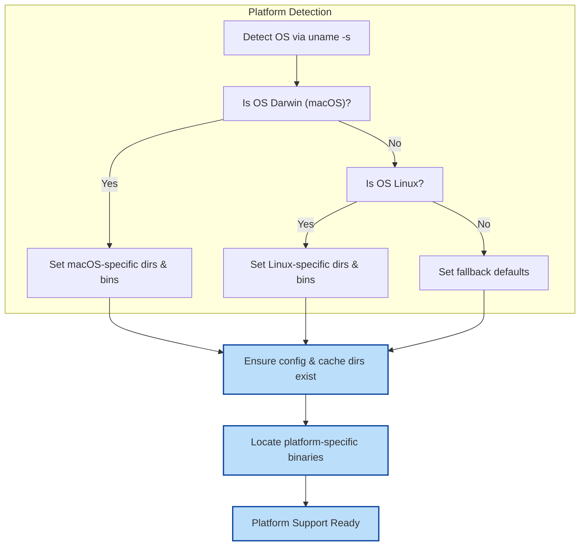

# Platform Support and Portability

MyCmd is designed to provide a consistent user experience across different operating systems and environments. This page explains how MyCmd detects key platform details, manages user-specific configuration and cache directories, handles locating necessary utilities, and delivers best practices for writing commands that work seamlessly on macOS, Linux, and other Unix-like systems.

---

## Understanding Platform Detection

MyCmd automatically detects the operating system it runs on through a simple but robust mechanism. This allows commands and libraries to adapt behavior as necessary for compatibility and performance.

- **Operating System Detection:**
  - On macOS systems, MyCmd identifies `Darwin` as the OS.
  - On Linux systems, it recognizes `Linux`.
  - This is achieved through querying `uname -s` once at startup.

### Why Platform Detection Matters

Different platforms have distinct default tools, file locations, and behaviors. For example, macOS includes BSD-flavored utilities by default, requiring GNU tools installed via Homebrew for compatibility. By detecting the OS, MyCmd can dynamically select the appropriate binaries and apply tailored logic.

<Info>
Platform detection ensures your commands behave predictably whether you run MyCmd on your Mac laptop, Linux server, or other Unix-like hosts.
</Info>

---

## Managing User Configuration and Cache Directories

MyCmd automatically determines standard locations for user configuration and cache files, creating directories on demand. This simplifies command development and leads to consistent storage across platforms.

### Platform-Specific Defaults

| Directory Type          | macOS Default Location                              | Linux and Others Default Location                  |
|------------------------|----------------------------------------------------|--------------------------------------------------|
| User Configuration     | `$HOME/Library/Application Support/mycmd`          | `$XDG_CONFIG_HOME/mycmd` (if set) or `$HOME/.config/mycmd` |
| User Cache             | `$HOME/Library/Caches/mycmd`                         | `$XDG_CACHE_HOME/mycmd` (if set) or `$HOME/.cache/mycmd`  |

MyCmd will ensure these directories exist before use.

### Accessing Config and Cache Files

Commands should use these helper functions to retrieve full paths to configuration or cache files relative to their fully qualified command name:

```bash
config_file_path=$(mycmd.get_user_config_file "mycmd/your/command" "config.ini")
cache_file_path=$(mycmd.get_user_cache_file "mycmd/your/command" "cache-file")
```

These helpers take care of platform differences, path creation, and segmentation automatically.

<Check>
Always use MyCmd's provided helpers to work with configuration and cache locations.
Avoid hardcoding paths, which can lead to broken commands on different platforms.
</Check>

---

## Locating Required System Utilities Across Platforms

Due to differences in default utilities on platforms like macOS versus Linux, MyCmd provides mechanisms to dynamically locate the appropriate executable for commands such as `awk`, `sed`, `grep`, and others.

- On macOS, it attempts to find Homebrew-installed GNU binaries (e.g., `gawk`, `gsed`) first.
- On Linux, it uses default path utilities.

This detection populates an associative array `MYCMD_BIN` keyed by command names, holding the full executable paths. Commands should invoke dependencies via this array for reliable cross-platform operation.

Example usage:

```bash
mycmd.bin_execute awk '{ print $1 }' file.txt
```

If a required utility is absent, MyCmd can either fail with a clear message or allow fallback depending on the initialization method.

---

## Writing Portable MyCmd Commands

To ensure your custom commands are portable and robust:

- **Leverage Platform Detection:** Use `mycmd.is_mac_os` and `mycmd.is_linux` functions to adapt logic.
- **Use Dynamic Binary Lookup:** Access required utilities through MyCmd’s `MYCMD_BIN` mappings and `mycmd.bin_execute` to avoid relying on system defaults.
- **Handle Config & Cache Paths via Helpers:** Always use `mycmd.get_user_config_file` and `mycmd.get_user_cache_file` rather than hardcoded paths.
- **Create Missing Directories Transparently:** Avoid errors by letting MyCmd create directories if missing; do not fail commands unnecessarily.

<Warning>
Do not hardcode paths or binaries assuming Linux or macOS defaults.
This will cause commands to fail or behave unexpectedly in different environments.
</Warning>

<Callout title="Best Practice">
Test your commands on each supported platform regularly.
Utilize MyCmd’s platform support library to reduce environment-specific bugs.
</Callout>

---

## Example: Condition-Based Command Behavior

```bash
if mycmd.is_mac_os; then
    echo 'Running on macOS - using GNU sed from Homebrew'
    mycmd.bin_execute sed 's/old/new/g' input.txt
elif mycmd.is_linux; then
    echo 'Running on Linux with native GNU sed'
    mycmd.bin_execute sed 's/old/new/g' input.txt
else
    echo 'Unknown Platform - proceeding with caution'
fi
```

This example demonstrates how to write a command that dynamically adjusts to environment specifics to maintain consistent behavior.

---

## Internal Workflow Visualization



---

## Troubleshooting Platform Issues

- If commands fail stating missing utilities like `gsed` or `gawk` on macOS, ensure you have installed GNU equivalents via Homebrew:

  ```shell
  brew install gsed gawk grep coreutils findutils
  ```

- Verify your environment variables such as `MYCMD_SYSTEM_BASE_DIR` and `MYCMD_USER_BASE_DIR` point to valid and accessible directories.

- If configuration or cache files seem missing or inaccessible, check directory permissions and ensure MyCmd created the directories.

- Use MyCmd’s debug and trace modes (`MYCMD_DEBUG`, `MYCMD_TRACE`) to gather more detail on what binaries are resolved and paths used.

<Note>
Platform differences are the most frequent cause of unexpected command failures; leverage MyCmd’s platform-aware utilities to prevent these.
</Note>

---

## Summary

MyCmd’s platform support library is the foundation that enables commands to run consistently across Unix-like systems by:

- Detecting operating system and tailoring functionality
- Establishing standard user configuration and cache directories
- Mapping to the correct system utilities regardless of platform

By adhering to the platform support conventions, you empower your commands to perform predictably and robustly in diverse environments without specialized configuration.

For next steps, explore [Writing Custom Commands and Command Groups](/guides/command-authoring-and-best-practices/writing-custom-commands) to see how to incorporate platform-aware techniques into your scripts.

---

## Related Documentation

- [Core Concepts & Terminology](/overview/architecture-core-concepts/core-concepts-terminology) — Understand fundamental MyCmd elements.
- [Command and Command Group Hierarchy](/mycmd-concepts/core-architecture/command-hierarchy) — Explore how commands are organized within MyCmd.
- [Launcher and Execution Flow](/mycmd-concepts/core-architecture/command-launcher-execution) — Learn how commands are discovered and run.
- [Extending Your Commands with Shell Libraries](/guides/advanced-workflows-and-integration/extending-with-shell-libraries) — Incorporate platform support and other reusable libraries.

---