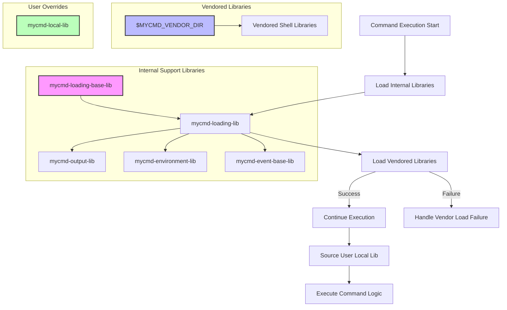

# Vendoring and Extending Libraries

Discover the approaches MyCmd uses for loading internal and third-party libraries, managing dependencies, and enabling users to extend or override behavior through the vendoring system.

---

## Introduction

MyCmd streamlines shell automation by organizing commands into hierarchical groups, but its true power lies in modularity through libraries. This page explains MyCmd’s strategy for loading internal support libraries and third-party vendored libraries, enabling you to manage dependencies cleanly while extending or overriding functionality as needed.

Whether you aim to reuse internal utilities or incorporate external shell libraries, MyCmd's vendoring system is designed for flexibility, reliability, and easy maintenance.

---

## Library Types in MyCmd

### Internal Support Libraries

MyCmd internal support libraries are specialized shell scripts that provide common functionality, such as output formatting, environment validation, event lifecycle management, and platform detection. These libraries are organized under the `mycmd` naming prefix and typically suffixed with `-lib`.

- Loaded automatically or on-demand using internal loading helpers.
- Protected to prevent accidental modification at runtime.
- Used to share logic across different commands and command groups.

### Vendored Third-Party Libraries

Vendored libraries are external shell scripts bundled within the MyCmd vendor directory (`MYCMD_VENDOR_DIR`). This allows third-party functionality to be incorporated while keeping it isolated from internal code.

- Typically stored under `$MYCMD_VENDOR_DIR`.
- Loaded explicitly by name using vendoring helper functions.
- Provide additional features without modifying core MyCmd source.

---

## How MyCmd Loads Libraries

MyCmd adopts structured shell functions and conventions to handle library loading with safeguards ensuring proper sourcing and avoiding redundant loads.

### Loading Internal Support Libraries

Internally, MyCmd uses functions from `mycmd-loading-lib` and `mycmd-loading-base-lib` to load support libraries safely.

- **mycmd.load_mycmd_lib_support_lib**: Given a library name (e.g., `output`), this resolves and sources its full path inside the internal library directory.
- Before sourcing, checks prevent re-loading already sourced libraries.
- Function protection mechanisms mark newly defined library functions as readonly to preserve integrity.

Example usage:
```bash
mycmd.load_mycmd_lib_support_lib "output"
```

### Loading Vendored Libraries

Vendored libraries are loaded using the `mycmd.load_vendor_library` function from the `mycmd-vendoring-lib` support library.

- Accepts the vendored library name (e.g., `ansi`) and attempts to source it from the `$MYCMD_VENDOR_DIR`.
- Logs trace information on loading attempts and errors.
- Returns failure if the vendored library does not exist, allowing graceful error handling.

Example usage:
```bash
mycmd.load_vendor_library ansi
```

If loading fails:
- An error message is output.
- The caller can decide to fallback or exit.

---

## Extending and Overriding Behavior

The vendoring system empowers users and developers to extend MyCmd’s capabilities or customize its behavior.

### User-Provided Local Libraries

Users can provide a `mycmd-local-lib` in their user base directory (`MYCMD_USER_BASE_DIR`). This local library is sourced conditionally and can override or augment existing functionality without modifying core or vendored code.

Example:
```bash
mycmd.source_mycmd_local_lib
```

### Benefits of This Approach

- **Modularity**: Commands and features can share functionality with clean dependencies.
- **Maintainability**: Easier to update vendored libraries independently.
- **Customizability**: Users can patch or extend behavior with local libraries.
- **Reliability**: Protective loading guards ensure libraries are sourced once and functions are protected.

---

## Practical Workflow for Library Loading

### Step 1: Load Required Internal Libraries

When crafting a command or command group, first load the essential internal support libraries using:
```bash
mycmd.load_mycmd_lib_support_lib "output"
mycmd.load_mycmd_lib_support_lib "environment"
```

These include helpers for formatted output, environment verification, event lifecycle handling, and platform awareness.

### Step 2: Load Vendored Libraries as Needed

Load external dependencies explicitly when your command logic requires them.
```bash
mycmd.load_vendor_library "ansi"
```

If loading fails, handle errors gracefully:
```bash
if ! mycmd.load_vendor_library "ansi"; then
    echo "Warning: ANSI library not available, proceeding without color support."
fi
```

### Step 3: Source User Local Overrides

Ensure user-specific logic or overrides load last:
```bash
mycmd.source_mycmd_local_lib
```

---

## Common Pitfalls and Troubleshooting

- **Library Not Found**: Ensure environment variables like `MYCMD_LIB_DIR` and `MYCMD_VENDOR_DIR` are set correctly and point to valid directories.
- **Duplicate Loading**: MyCmd prevents re-sourcing libraries by tracking loaded files internally, so reloading is avoided.
- **Unprotected Functions**: Newly loaded libraries' functions are automatically marked readonly to avoid accidental changes.

If you encounter errors such as 'library not found' or missing functions:
1. Verify your environment variables `MYCMD_USER_BASE_DIR`, `MYCMD_SYSTEM_BASE_DIR`, and `MYCMD_VENDOR_DIR` are correctly set and directories are accessible.
2. Check your `MYCMD_SEARCH_PATH` configuration to ensure libraries are discoverable.
3. Use verbose tracing output (`mycmd.trace`) to review the loading process.

---

## Diagram: Library Loading Flow



---

## Summary

MyCmd employs a robust system for managing internal support and third-party vendored shell libraries. By organizing library loading through dedicated functions, protecting loaded functions, and allowing user overrides, MyCmd ensures your automation framework remains modular, extensible, and reliable.

When authoring commands, load required internal libraries first, followed by vendored libraries as needed, and optionally source user override libraries for customization. This approach delivers a clean separation of concerns, dependency management, and upgrade paths for your command line scripting environment.

---

## Related Documentation

- [Extending Your Commands with Shell Libraries](../guides/advanced-workflows-and-integration/extending-with-shell-libraries)
- [Vendoring and Extending Libraries](./mycmd-concepts/internals-and-extensibility/vendoring-and-extending)
- [Command and Command Group Hierarchy](./mycmd-concepts/core-architecture/command-hierarchy)
- [MyCmd Search Path](./mycmd-concepts/core-architecture/mycmd-search-path)
- [Lifecycle Events and Deferred Actions](./mycmd-concepts/internals-and-extensibility/event-lifecycle)
- [Debugging and Logging in Your Commands](../guides/command-authoring-and-best-practices/debugging-commands)

---

## Practical Tips

- Always check library load outcomes and handle failures gracefully to avoid abrupt script termination.
- Use tracing (`mycmd.trace`) judiciously for diagnostics during development.
- Organize custom reusable logic into internal support libraries or vendored libraries to promote code reuse.
- Place user custom overrides in `mycmd-local-lib` to keep core code intact during upgrades.

With these principles, you’ll harness the full power of MyCmd’s modular architecture, improving both your productivity and script maintainability.
