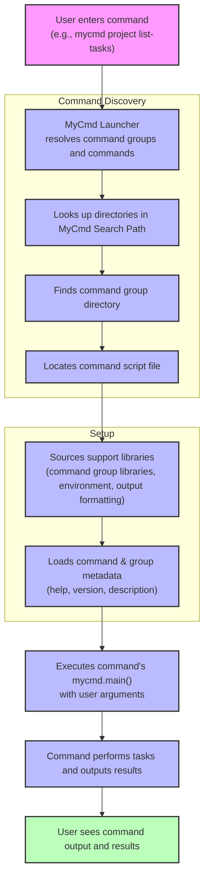

# How MyCmd Works: Typical Workflow

Welcome to your first step in mastering MyCmd. This guide walks you through the typical user journey of crafting commands, organizing them into command groups, leveraging reusable support libraries, and running your commands via the MyCmd launcher. Designed to orient new users, it connects hands-on command authoring with MyCmd’s powerful hierarchical structure and execution flow.

---

## What to Expect From This Page

This narrative walkthrough covers:

- Writing individual commands
- Structuring commands into hierarchical command groups
- Using support libraries for code sharing and functionality extension
- Running commands via the MyCmd launcher

This page builds directly on concepts introduced in the [Core Concepts & Terminology](../core-concepts-terminology) and the architectural overview provided in the [System Architecture (with Diagram)](../architecture-system-diagram) page.

---

## Starting With Commands: Writing Your First Script

At the heart of MyCmd's workflow is the individual **command**—a small, focused shell script designed to perform one specific task. Writing commands with MyCmd means thinking in terms of reusable, encapsulated scripts, not sprawling scripts that try to do everything.

**Key principles:**

- Each command is a shell script file with a unique name within a command group directory.
- Commands implement a `mycmd.main()` function, which acts as the entry point when executed.
- Commands register metadata such as short descriptions, help text, and version information, simplifying help and documentation generation.

**Example:**

Imagine you want a command to list all tasks in a MyCmd project. You write a script named `list-tasks` inside the `project` command group directory, implement `mycmd.main()` to perform the listing, and register metadata for version and help display. This script is executed via the launcher, but you write and maintain it as a standalone command script.

---

## Organizing Commands Into Command Groups

Commands are rarely isolated. Grouping related commands into **command groups** is the core organizational principle in MyCmd. A command group corresponds to a directory containing commands, along with a shared shell library (named `{command-group-name}-lib`) containing support functions and reusable code.

**Why command groups matter:**

- They create a hierarchical structure reflecting logical organization (e.g., `mycmd project` groups project-related commands).
- Code reuse within a command group through shared libraries reduces duplication and encourages maintainability.
- Metadata and help text managed at the group level provides consistent user experience.

**How to use them:**

- Place commands inside the appropriate directory for the command group.
- Include a `{command-group-name}-lib` shell script in the same directory that your commands can source automatically.
- Use provided support libraries to register metadata and interact with the command group environment.

---

## Leveraging Support Libraries for Reuse and Extension

MyCmd offers several built-in support libraries that you can load inside your command groups or commands to extend functionality without reinventing the wheel.

**Common support libraries include:**

- **Event Lifecycle:** For handling startup, deferred actions and cleanup logic.
- **Formatted Output:** For consistent, colored, and structured display of command output.
- **Registry:** Facilitates registration and lookup of commands and groups.
- **Environment:** Validates and manages shell environment variables for robust execution.

By loading these libraries in your group or command libraries, you ensure your scripts behave consistently, follow best practices, and integrate smoothly with MyCmd's runtime environment.

**Practical tip:** If you write complex commands, encapsulate shared behavior inside a support library for the command group. This enables easy reuse across all commands in that group and keeps your codebase clean.

---

## Running Commands Via the MyCmd Launcher

The user interacts with MyCmd through the `mycmd` launcher—your command-line entry point. When you run a command with `mycmd`, you specify the command group hierarchy followed by the command name.

**Example:**

```shell
mycmd project list-tasks
```

**How the launcher works:**

1. **Command Resolution:** The launcher uses the configured MyCmd Search Path to find the appropriate command group directories and command scripts.
2. **Metadata Loading:** The launcher loads command and command group metadata to prepare help/version info.
3. **Support Library Loading:** It sources required support libraries to create a consistent execution environment.
4. **Command Execution:** The launcher sets up environment variables like `_MYCMD_FULLY_QUALIFIED_NAME` and `_MYCMD_NAMESPACED_PARTS_STRING`, then calls the command’s `mycmd.main()` function with any user-provided arguments.

This sequence ensures reliable, predictable command behavior, while providing built-in support for help, version flags, and user-friendly error messages.

---

## Bringing It All Together: User Flow Example

Here’s a simplified flow from user intent to execution:

<Steps>
<Step title="Write a New Command">
Create a shell script named for your command inside the appropriate command group directory.
</Step>
<Step title="Implement mycmd.main()">
Define your command’s entry point function which receives user arguments.
</Step>
<Step title="Register Metadata">
Add descriptive text, help messages, and version numbers for user-friendly interactions.
</Step>
<Step title="(Optional) Create Support Library">
If you have reusable code, create a support library script in the command group directory and load it in your commands.
</Step>
<Step title="Run via Launcher">
Invoke your command using the `mycmd` launcher, specifying the command group hierarchy and command name.
</Step>
</Steps>

---

## Common Pitfalls and How to Avoid Them

- **Forgetting to implement `mycmd.main()`:** Commands must define this function as the entry point. Without it, execution fails.

- **Not registering metadata:** This results in poor or missing help/version information, confusing users.

- **Ignoring the command group structure:** Placing commands outside groups or misplacing support libraries breaks the hierarchical discovery.

- **Environment variable dependencies:** Ensure required environment variables like `MYCMD_SYSTEM_BASE_DIR` and paths are correctly set.

- **Not sourcing support libraries:** Your commands might miss essential functionality or styling.

A good practice is to start with the example command template provided in the MyCmd project to ensure all necessary components are present.

---

## Visualizing the Typical Workflow



---

## Next Steps

Now that you understand the typical workflow for MyCmd, move on to:

- [Writing Custom Commands and Command Groups](../../guides/command-authoring-and-best-practices/writing-custom-commands) for detailed authoring guidance.
- [Automating Project Workflows with MyCmd](../../guides/advanced-workflows-and-integration/automating-project-workflows) to leverage MyCmd for real-world automation.
- [Setting Up Your Environment](../../getting-started/setup-prerequisites-installation/path-setup-post-install) for prerequisite environment configuration.

---

<Tip>
Remember, the power of MyCmd comes from its organized structure, reusable shared code, and consistent execution flow. Adopting this workflow will enhance your shell scripting productivity and maintainability.
</Tip>